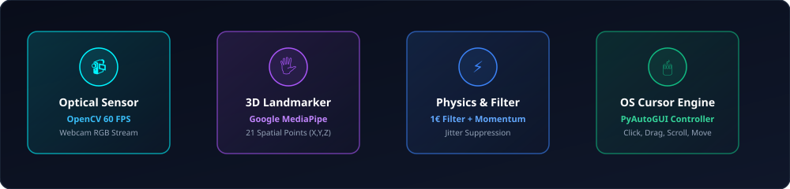
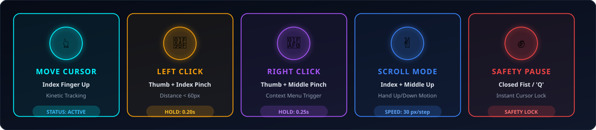

<div align="center">

<!-- Animated 3D Holographic Hero Banner -->
<p align="center">
  
</p>

# 🌌 AI HAND GESTURE CONTROL SYSTEM (J.A.R.V.I.S)

### *Touchless Spatial Computing &amp; Optical Air Mouse Interface for PC*

[](https://www.python.org/)
[](https://developers.google.com/mediapipe)
[](https://opencv.org/)
[](https://pyautogui.readthedocs.io/)
[](https://numpy.org/)
[](LICENSE)
[](https://github.com/)

<p align="center">
  <a href="#-overview"><b>Overview</b></a> •
  <a href="#-system-architecture"><b>Architecture</b></a> •
  <a href="#-gesture-control-matrix"><b>Gestures</b></a> •
  <a href="#-quickstart--installation"><b>Quickstart</b></a> •
  <a href="#-deep-dive-math--physics"><b>Math &amp; Physics</b></a> •
  <a href="#%EF%B8%8F-configuration"><b>Config</b></a> •
  <a href="#-license"><b>License</b></a>
</p>

---

</div>

## 🪐 Overview

> *"I am not controlling a computer. The computer understands my intent."*

The **AI Hand Gesture Control System** is a real-time, hardware-agnostic human-computer interaction (HCI) software suite. Using an everyday RGB webcam, it turns your hand into an ultra-smooth, jitter-free **optical air mouse**. 

By tracking **21 three-dimensional anatomical landmarks** in real time and passing them through a **One-Euro signal filter** and a **kinetic physics engine with momentum**, the system achieves millimeter-grade precision without requiring gloves, infrared sensors, or external peripherals.

---

## ⚡ Real-Time Processing Pipeline

<p align="center">
  
</p>

The architecture operates in four synchronized micro-stages running at **30–60+ FPS**:

```mermaid
graph LR
    A["📹 Camera Stream\n(OpenCV 640x480)"] --> B["🖐️ 3D Landmark Extractor\n(MediaPipe Tasks)"]
    B --> C["⚡ OneEuroFilter\n(Adaptive Jitter Removal)"]
    C --> D["🧠 Intent State Machine\n(Confidence Buckets)"]
    D --> E["🚀 Physics Engine\n(Momentum & Dead-Zone)"]
    E --> F["🖱️ OS Cursor Control\n(PyAutoGUI Subsystem)"]
    
    style A fill:#0b1329,stroke:#00f5ff,stroke-width:2px,color:#fff
    style B fill:#0b1329,stroke:#a855f7,stroke-width:2px,color:#fff
    style C fill:#0b1329,stroke:#3b82f6,stroke-width:2px,color:#fff
    style D fill:#0b1329,stroke:#f59e0b,stroke-width:2px,color:#fff
    style E fill:#0b1329,stroke:#10b981,stroke-width:2px,color:#fff
    style F fill:#0b1329,stroke:#ef4444,stroke-width:2px,color:#fff
```



---

## ✋ Gesture Control Matrix

<p align="center">
  
</p>

| Mode &amp; Action | Physical Gesture | Detection Threshold | Visual HUD State | System Response |
| :--- | :--- | :--- | :--- | :--- |
| **🟢 MOVE CURSOR** | **Index Finger ONLY** raised; other fingers curled | $\Delta \text{pos} > \text{DeadZone}$ | 🎯 Cyan Reticle tracking fingertip | Smooth, accelerated cursor displacement |
| **🟡 LEFT CLICK** | **Thumb + Index Finger** pinch | Finger Distance $< 60\text{ px}$ | 🟡 Shrinking orange ring $\rightarrow$ Red burst | Primary click (`pyautogui.click()`) |
| **🟣 RIGHT CLICK** | **Thumb + Middle Finger** pinch | Finger Distance $< 50\text{ px}$ | 🟣 Purple aura burst | Context menu (`pyautogui.rightClick()`) |
| **🔵 SCROLL MODE** | **Index + Middle Fingers** up (Victory sign) | Both fingers extended | ↕️ Blue vertical dual-vector arrows | Page scroll up/down based on hand velocity |
| **🔴 SAFETY PAUSE** | **Closed Fist** | All fingertips $< \text{MCP}$ joints | 🛑 Full-screen Red border + "PAUSED" | Complete input freeze; prevents misclicks |
| **⏹️ EMERGENCY EXIT** | Press **`Q`** key on physical keyboard | Instant keypress event | ⚠️ Safe release &amp; camera unbind | Clean process termination |

---

## 🚀 Key Features

* 🎛️ **Kinetic Air Mouse with Momentum**: Applies virtual mass and drag equations to mouse movement for natural, fluid navigation.
* 🎯 **Adaptive One-Euro Filter**: Eliminates high-frequency muscle tremor when hand is static while maintaining zero lag during rapid swipes.
* 🛡️ **Confidence-Bucket Intent Engine**: Employs hysteresis and temporal debounce (0.2s hold duration) to eliminate accidental clicks.
* 🌐 **Holographic Sci-Fi HUD**: Real-time Heads-Up Display showing FPS telemetry, tracking confidence, connection skeletons, and interactive dynamic reticles.
* 🚦 **Fail-Safe Watchdog**: Auto-freezes cursor if frame rate drops below 10 FPS or the hand exits camera frame boundaries.

---

## 🔬 Deep Dive: Math &amp; Physics Models

<details>
<summary><b>📐 1. One-Euro Signal Filtering ($\text{1 }€\text{ Filter}$)</b></summary>
<br>

Human hands naturally exhibit micro-tremors at rest. Standard low-pass filters introduce latency during fast motions. The $1 €$ filter dynamically tunes its cutoff frequency $f_c$ based on fingertip velocity $\dot{x}$:

$$f_c = f_{c_{\min}} + \beta |\dot{x}|$$

$$\alpha = \frac{1}{1 + \frac{\tau}{T_e}} \quad \text{where } \tau = \frac{1}{2\pi f_c}, \; T_e = \Delta t$$

$$\hat{x}_t = \alpha x_t + (1 - \alpha) \hat{x}_{t-1}$$

* When **hand is still** ($\dot{x} \approx 0$): $f_c \rightarrow f_{c_{\min}}$, high filtering eliminates all hand jitter.
* When **hand is moving** ($|\dot{x}| \gg 0$): $f_c$ expands dynamically, removing lag completely.

</details>

<details>
<summary><b>⚡ 2. Non-Linear Velocity &amp; Kinetic Gain</b></summary>
<br>

Relative delta movement incorporates dead-zone filtering and quadratic acceleration curves:

$$\text{gain} = \min\Big(\text{BaseSensitivity} \times \big(1.0 + k \cdot \|\mathbf{\Delta v}\|\big), \; \text{MaxSensitivity}\Big)$$

$$\mathbf{\Delta P}_{\text{screen}} = \mathbf{\Delta v} \times \text{WindowSize} \times \text{gain}$$

* **Dead Zone**: Micro-movements below threshold ($\epsilon < 0.002$) are filtered out so that clicking does not displace cursor position.
* **Fractional Accumulator**: Fractional pixel displacements are preserved across frames to prevent micro-stuttering.

</details>

---

## 📊 Version Comparison: Legacy vs. V3.0 J.A.R.V.I.S

| Capability | Version 1 &amp; 2 (Baseline) | Version 3.0 J.A.R.V.I.S (Current) |
| :--- | :--- | :--- |
| **Tracking Pipeline** | Absolute pixel coordinate mapping | **Relative delta vector tracking ($\Delta x, \Delta y$)** |
| **Jitter Suppression** | Static linear interpolation (`np.interp`) | **Dual-stage One-Euro Filter + Exponential LPF** |
| **Click Detection** | Raw Euclidean distance snapshot | **Hysteresis state machine with confirmation rings** |
| **Mouse Dynamics** | Instantaneous teleportation | **Momentum, friction, and velocity gain curves** |
| **Visual Interface** | Basic OpenCV circles and lines | **Futuristic holographic HUD with finger trails &amp; telemetry** |
| **Safety Net** | Border clamping | **Multi-tiered: Dead zones, Auto-pause, Low-FPS failsafe** |

---

## 🛠️ Quickstart &amp; Installation

### 1. Clone the Repository
```bash
git clone https://github.com/your-username/Control-PC-using-Hand-Gesture.git
cd Control-PC-using-Hand-Gesture
```

### 2. Set Up Virtual Environment (Recommended)
```bash
python -m venv venv
# On Windows:
venv\Scripts\activate
# On Linux/macOS:
source venv/bin/activate
```

### 3. Install Required Dependencies
```bash
pip install -r requirements.txt
```

> [!NOTE]
> Dependencies include: `opencv-python`, `mediapipe`, `numpy`, and `pyautogui`.

### 4. Ensure Model Asset is Present
Ensure [`hand_landmarker.task`](file:///c:/Users/aravi/Desktop/Control-PC-using-Hand-Gesture-main/hand_landmarker.task) is in the root directory. If missing, download it via PowerShell:
```powershell
Invoke-WebRequest -Uri https://storage.googleapis.com/mediapipe-models/hand_landmarker/hand_landmarker/float16/1/hand_landmarker.task -OutFile hand_landmarker.task
```

### 5. Launch the Interface
* **Launch Version 3.0 (Recommended - Air Mouse + HUD)**:
  ```bash
  python main_v3.py
  ```
* **Launch Version 2 (Legacy Absolute Mapping)**:
  ```bash
  python gesture_recognition.py
  ```

---

## ⚙️ Configuration Tuning

All sensitivities and thresholds can be calibrated inside [`config.py`](file:///c:/Users/aravi/Desktop/Control-PC-using-Hand-Gesture-main/config.py) and [`gesture_v3/config.py`](file:///c:/Users/aravi/Desktop/Control-PC-using-Hand-Gesture-main/gesture_v3/config.py):

```python
# ==========================================
# SENSITIVITY & VELOCITY CALIBRATION
# ==========================================
BASE_SENSITIVITY      = 1.8      # Base cursor speed multiplier
MAX_SENSITIVITY       = 4.5      # Maximum speed under rapid flick
ACCELERATION_FACTOR   = 12.0     # Dynamic acceleration sensitivity
DEAD_ZONE             = 0.002    # Minimum movement to register delta

# ==========================================
# GESTURE THRESHOLDS
# ==========================================
CLICK_DISTANCE_THRESHOLD = 60    # Maximum px between Thumb & Index for click
CLICK_HOLD_TIME          = 0.20  # Hold duration in seconds to trigger click
GESTURE_COOLDOWN         = 0.50  # Debounce delay between successive clicks
SCROLL_SPEED             = 30    # Pixels per scroll increment

# ==========================================
# SYSTEM & SAFETY
# ==========================================
FPS_TARGET               = 30    # Target processing frame rate
FAILSAFE_FPS             = 10    # Pause control if camera FPS drops below this
```

---

## 📂 Project Architecture

```
Control-PC-using-Hand-Gesture/
├── assets/                          # Animated vector visual assets & HUD SVGs
│   ├── hero-banner.svg              # 3D holographic animated header banner
│   ├── pipeline.svg                 # Animated processing flow diagram
│   └── gestures.svg                 # Animated gesture control cards
├── gesture_v3/                      # Production V3.0 (J.A.R.V.I.S Engine)
│   ├── control/
│   │   └── mouse_physics.py         # Momentum, friction, and cursor acceleration
│   ├── core/
│   │   └── system.py                # Main event lifecycle & state loop
│   ├── intent/
│   │   └── classifier.py            # Confidence buckets & gesture classification
│   ├── perception/
│   │   ├── smoothing.py             # OneEuroFilter & Exponential LPF
│   │   └── tracker.py               # MediaPipe HandLandmarker wrapper
│   └── ui/
│       └── hud.py                   # Holographic HUD, reticles, and visual telemetry
├── config.py                        # Global configuration parameters
├── hand_landmarker.task             # Google MediaPipe 21-point neural bundle
├── hand_tracking.py                 # Core landmark extraction & visualizer
├── gesture_recognition.py           # V2 Gesture detector & state engine
├── mouse_control.py                 # Direct PyAutoGUI controller
├── main_v3.py                       # V3.0 Primary entry point
├── requirements.txt                 # Runtime dependencies
└── LICENSE                          # MIT Open Source License
```

---

## 🛡️ Safety &amp; Fail-Safe Systems

1. **Auto-Pause on Hand Absence**: If your hand exits the camera frame, tracking immediately releases to prevent runaway cursor drift.
2. **Low-FPS Watchdog**: If camera performance drops below 10 FPS due to system load or lighting conditions, inputs pause automatically.
3. **Emergency Disarm**: Tap **`Q`** at any moment in the OpenCV viewport for an instantaneous shutdown.

---

## 📄 License

This project is licensed under the terms of the **MIT License**. See the [LICENSE](LICENSE) file for the full license text.

---

<div align="center">

### 🌟 Project Status &amp; Future Innovations
*Voice commands integration ("Computer, click") • Air-typing virtual keyboard • Custom ML gesture training*

<br>

**Crafted with ❤️ for Next-Generation Human-Computer Interaction**

</div>
